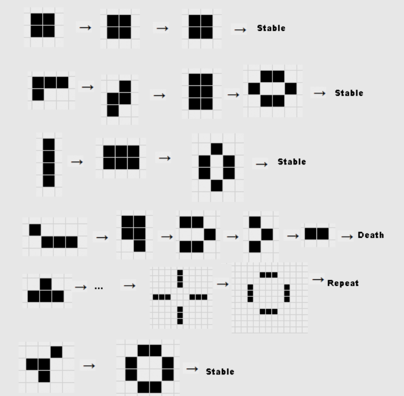

# Spreadsheet Application

This is a Java-based spreadsheet application with several features, including saving/loading spreadsheets, implementing Conway's Game of Life, and extending a version of Tetris (called Tetros). The application is designed to work with a `Sheet` object that can be manipulated in various ways and supports saving to and loading from files.

## Features

### 1. File Load & Saving
This component allows you to save and load a spreadsheet in a custom file format. When saving, the state of the `Sheet` is written to a file, and when loading, the file is parsed to restore the `Sheet` to its original state. This feature ensures the spreadsheet is preserved across sessions.

#### Requirements
- No use of Java Serialization.
- The current `Sheet` instance is updated, not a new instance.
- Clears the `Sheet` before updating it with new data (starting from the top left and populating row by row).

#### Feature Functions
- **File Loading**: Allows loading a spreadsheet from a file.
- **File Saving**: Allows saving the current spreadsheet to a file.

### 2. Game of Life
This component implements Conway's Game of Life, a cellular automaton that operates on a grid. Each tile in the grid can be either "on" or "off", and at each tick, the state of the grid is updated based on the following rules:

1. Any "on" cell with fewer than two "on" neighbours turns "off".
2. Any "on" cell with two or three "on" neighbours stays "on".
3. Any "on" cell with more than three "on" neighbours turns "off".
4. Any "off" cell with exactly three "on" neighbours turns "on", otherwise stays "off".

The game runs in a loop until stopped, updating the `Sheet` each tick.

### 3. Tetros (Tetris Variation)
A simplified and intentionally diverging version of Tetris is implemented as Tetros. While it doesn't follow the exact traditional rules of Tetris, it provides a similar gameplay experience.

#### Tetros Refactoring
The Tetros implementation is refactored to ensure flexibility, maintainability, and future extensibility. This refactor preserves the original game behavior, including its intentional deviations from standard Tetris mechanics. 


## Components

### `FileLoading` & `FileSaving`
- **FileLoading**: Loads a spreadsheet from a specified file path.
- **FileSaving**: Saves the current state of the `Sheet` to a specified file path.

### `GameOfLife` (Conway’s Game of Life)
Implements the cellular automaton simulation where each cell updates its state based on the number of adjacent "on" cells.

### `Tetros`
A simplified Tetris game where the provided implementation diverges from the traditional Tetris rules.
## Usage

### Starting the Application
1. **Load Spreadsheet**: You can load a spreadsheet from a file by using the `"load-file"` feature. You'll be prompted to specify the file path.
2. **Save Spreadsheet**: To save the current spreadsheet, use the `"save-file"` feature, where you'll specify the file path.
3. **Start Game of Life**: You can start the Game of Life by using the `"gol-start"` feature. The game will simulate the grid updates automatically.
4. **Stop Game of Life**: To stop the simulation, use the `"gol-end"` feature.
5. **Play Tetros**: The Tetros game will run in its simplified version, with intentionally non-standard mechanics. The game will function as designed.

## Requirements
- Java 11 or higher
- IntelliJ IDEA or your preferred Java IDE
- JUnit for unit testing

## Installation

1. Clone the repository or download the `.zip` archive.
2. Import the project into IntelliJ IDEA (or another IDE).
3. Ensure the project compiles and passes all JUnit tests.

```bash
git clone https://github.com/yourusername/SpreadsheetApp.git
cd SpreadsheetApp
